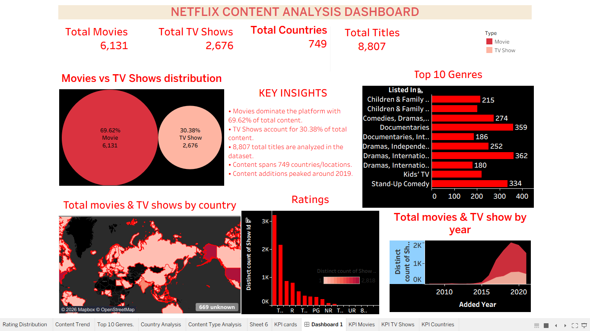

# 🎬 Netflix Content Analysis Dashboard

<p align="center">
  
  
  
  
  
</p>

<p align="center">
  An interactive data visualization project exploring Netflix Movies and TV Shows using Python, MySQL and Tableau.
</p>

---

## 📊 Dashboard Preview

<p align="center">
  
</p>

### 🔗 Interactive Dashboard

<p align="center">
  <a href="https://public.tableau.com/app/profile/kumkum.soni1357/viz/NetflixContentAnalysisDashboard_17887848696330/Dashboard1">
    
  </a>
</p>

---

## 📌 Overview

This project analyzes the Netflix Movies and TV Shows dataset to understand content distribution, ratings, countries, genres and content trends over the years.

The dataset was prepared using Python and Pandas, explored using MySQL, and visualized through an interactive Tableau dashboard.

---

## 🎯 Objectives

- Analyze Movies vs TV Shows distribution
- Explore content by country/location
- Understand rating distribution
- Identify frequently occurring genre categories
- Analyze content addition trends over the years
- Present key findings through an interactive dashboard

---

## ✨ Dashboard Features

- 🎞️ KPI Cards
- 🍿 Movies vs TV Shows Distribution
- 🌍 Country-wise Analysis
- ⭐ Rating Distribution
- 🎭 Top 10 Genre Categories
- 📈 Content Addition Trend
- 🔎 Movie / TV Show Filter
- 💡 Key Insights

---

## 📈 Key Insights

| Metric | Value |
|---|---:|
| 🎬 Total Titles | 8,807 |
| 🍿 Movies | 6,131 |
| 📺 TV Shows | 2,676 |
| 🌍 Country/Location Entries | 749 |
| 🎬 Movie Share | 69.62% |
| 📺 TV Show Share | 30.38% |

### Main Observations

- Movies make up the majority of the Netflix catalog in the dataset.
- Movies account for **69.62%** of the total titles.
- TV Shows account for **30.38%**.
- The dataset contains **8,807 titles** in total.
- Content additions increased considerably during the later years of the dataset.

---

## 🔄 Data Preparation

Python and Pandas were used to prepare the dataset before visualization.

Main steps:

- Loaded and inspected the CSV dataset
- Checked missing values and data types
- Cleaned date-related fields
- Extracted `Added Year` and `Added Month`
- Prepared the dataset for Tableau
- Exported the cleaned CSV

Cleaned dataset:

`dataset/netflix_titles_cleaned.csv`

---

## 🗃️ SQL Analysis

MySQL was used for basic data exploration and analysis.

SQL file:

`sql/netflix_analysis.sql`

---

## 🛠️ Tech Stack

| Technology | Purpose |
|---|---|
| 🐍 Python | Data Cleaning |
| 🐼 Pandas | Data Manipulation |
| 🗄️ MySQL | SQL Analysis |
| 📊 Tableau Public | Data Visualization |
| 🐙 GitHub | Project Documentation |

---

## 📂 Project Structure

```text
Netflix-Content-Analysis-Dashboard/
│
├── dataset/
│   ├── netflix_titles.csv
│   └── netflix_titles_cleaned.csv
│
├── python/
│   ├── data_cleaning.py
│   └── mysql_import.py
│
├── screenshots/
│   └── netflix-dashboard.png
│
├── sql/
│   └── netflix_analysis.sql
│
├── tableau/
│   ├── Book1_12044.twb
│   └── Book1.twb
│
└── README.md

## 📊 Tableau Worksheets

The final dashboard combines multiple interactive visualizations:

- 📌 KPI Cards
- 🎬 Movies vs TV Shows Distribution
- 🌍 Country Analysis
- ⭐ Rating Distribution
- 🎭 Top 10 Genre Categories
- 📈 Content Trend
- 💡 Key Insights

## 📁 Dataset

The project uses the Netflix Movies and TV Shows dataset.

### Main Fields

`Title`, `Type`, `Country`, `Date Added`, `Release Year`, `Rating`, `Duration`, `Listed In`, `Description`

## 🚀 How to Explore

### 1. Clone the Repository

```bash
git clone https://github.com/sonikumkum/Netflix-Content-Analysis-Dashboard.git

2. Open the Project

Open the project folder in VS Code or your preferred editor.

3. Run the Data Cleaning Script
python python/data_cleaning.py
4. Explore the SQL Analysis

Open sql/netflix_analysis.sql in MySQL Workbench.

5. Open the Tableau Workbook

Open the .twb file from the tableau/ folder.

6. View the Dashboard

Use the View Interactive Dashboard button above to explore the published Tableau dashboard.


### 💭 What I Learned

```markdown
## 💭 What I Learned

- 🐍 Data cleaning using Python and Pandas
- 🗃️ SQL-based data analysis
- 📊 Tableau dashboard development
- 📌 KPI cards and interactive visualizations
- 📈 Data-driven storytelling
- 🐙 GitHub project documentation

---
🔮 Future Improvements
## 🔮 Future Improvements

- 🎭 Improve genre-level analysis by splitting combined genre values
- 🎬 Add director and cast analysis
- 📊 Add more advanced KPIs
- 🔎 Add additional dashboard interactions

👩‍💻 Author
Kumkum Soni

MCA | Data Analytics & Web Development

<p align="center"> <a href="https://github.com/sonikumkum">  </a> </p>
